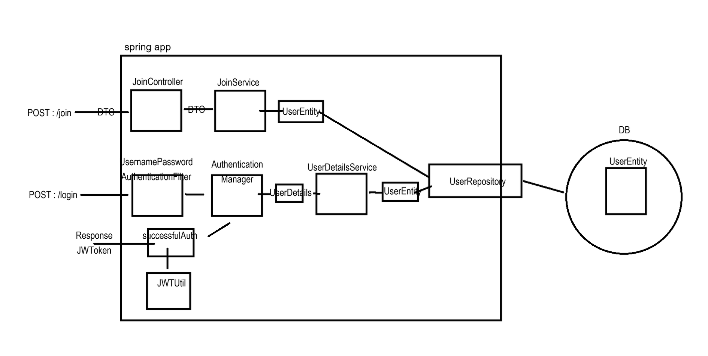

# JWT 강의 24.10.11
***
## 기본 의존성 추가
| Dependency             | Description                                                                                  |
|------------------------|----------------------------------------------------------------------------------------------|
| **Lombok**             | 자바에서 보일러플레이트 코드를 줄여주는 라이브러리. Getter, Setter, 생성자 등을 자동 생성.       |
| **Spring Web**          | 웹 애플리케이션을 만들기 위한 기본적인 의존성. RESTful 웹 서비스와 서블릿을 쉽게 구현.           |
| **Spring Security**     | 애플리케이션 보안을 위한 프레임워크. 인증, 권한 부여, 로그인 및 기타 보안 기능 제공.             |
| **Spring Data JPA**     | 자바 애플리케이션에서 JPA(Java Persistence API)를 쉽게 사용할 수 있도록 지원.                  |
| **MySQL Driver**        | 스프링 애플리케이션에서 MySQL 데이터베이스와 연결하기 위한 JDBC 드라이버.                      |
| **Spring DevTools**     | 개발 생산성 향상을 위해 제공되는 도구. 자동 재시작, 라이브 리로드, 캐시 비활성화 등의 기능 제공. |

#### JWT 관련 의존성 추가
    implementation 'io.jsonwebtoken:jjwt-api:0.12.3'
    implementation 'io.jsonwebtoken:jjwt-impl:0.12.3'
    implementation 'io.jsonwebtoken:jjwt-jackson:0.12.3'
***

## SecurityConfig

아래는 주어진 `SecurityConfig` 클래스에 대한 설명을 **README.md** 파일에 넣기 위한 설명입니다. 각 설정에 대한 설명을 구체적으로 기술하고, 설정의 의미를 이해할 수 있도록 구성했습니다.

### 1. CSRF 비활성화

```java
http.csrf((auth) -> auth.disable());
```

- **설명**: CSRF(Cross-Site Request Forgery)는 웹 애플리케이션에서 권한이 있는 사용자가 의도하지 않은 행동을 하도록 속이는 공격을 방지하는 기능입니다.
- **이유**: JWT를 사용하는 경우 서버가 세션을 유지하지 않기 때문에 CSRF 보호가 불필요합니다. 따라서 CSRF 보호 기능을 비활성화했습니다.

### 2. Form 로그인 방식 비활성화

```java
http.formLogin((auth) -> auth.disable());
```

- **설명**: 기본적인 Spring Security의 폼 기반 로그인 기능을 비활성화합니다.
- **이유**: 이 애플리케이션은 JWT를 사용하여 인증을 처리하므로, 서버에서 세션을 유지하거나 폼 기반 로그인을 사용할 필요가 없습니다.

### 3. HTTP Basic 인증 비활성화

```java
http.httpBasic((auth) -> auth.disable());
```

- **설명**: HTTP Basic 인증은 클라이언트가 매 요청마다 사용자 이름과 비밀번호를 전달하는 방식입니다.
- **이유**: JWT를 사용하여 인증을 처리하므로, HTTP Basic 인증 방식을 비활성화했습니다.

### 4. 경로별 인가 작업

```java
http.authorizeHttpRequests((auth) -> auth
    .requestMatchers("/login", "/", "/join").permitAll()
    .requestMatchers("/admin").hasRole("ADMIN")
    .anyRequest().authenticated());
```

- **설명**:
    - `/login`, `/`, `/join` 경로에 대해서는 누구나 접근할 수 있도록 허용했습니다.
    - `/admin` 경로에 대해서는 **ADMIN** 역할을 가진 사용자만 접근할 수 있도록 설정했습니다.
    - 그 외의 모든 경로에 대해서는 인증된 사용자만 접근할 수 있도록 했습니다.

### 5. 세션 설정 (Session Creation Policy)

```java
http.sessionManagement((session) -> session
    .sessionCreationPolicy(SessionCreationPolicy.STATELESS));
```

- **설명**: JWT를 사용하는 애플리케이션에서는 서버 측에서 세션을 유지하지 않기 때문에, 세션을 아예 생성하지 않도록 설정했습니다.
- **이유**: `SessionCreationPolicy.STATELESS`를 사용하여 Spring Security가 세션을 생성하거나 사용하지 않도록 설정합니다. 모든 요청은 JWT를 통해 인증됩니다.

### 결론

이 보안 설정은 **JWT 기반 인증**을 위한 기본적인 설정을 포함하고 있으며, CSRF 보호와 세션을 비활성화하고, 경로별로 접근 권한을 설정하여 안전한 인증과 인가를 처리합니다.

