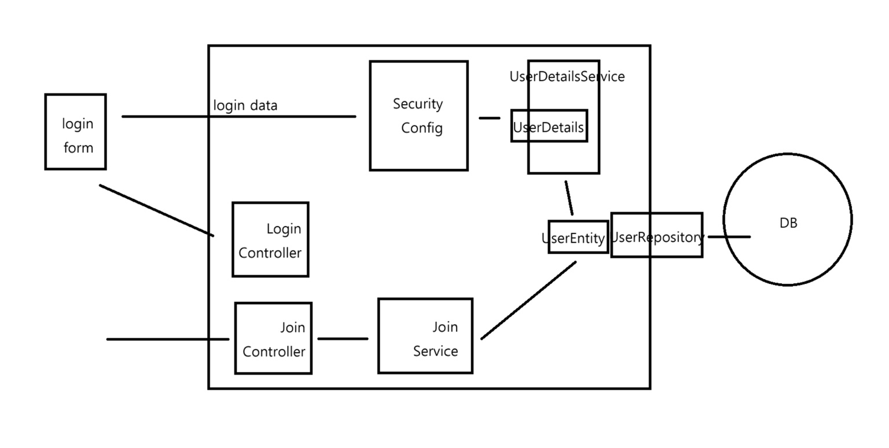

# SpringBoot Security 학습 및 JWT 학습
***
### 2024.10.11 유튜브 : 개발자 유미를 통한 스프링 시큐리티 학습
https://www.devyummi.com/page?id=668bd2d92b88a1ef5f2be2e3
과정을 따라하면서 스프링 시큐리티 다시 한 번 개념 학습.(그림. 블로그 참조)

### 로그인 로직

	1.	사용자는 Login Form에 로그인 데이터를 입력하고 제출합니다.
	2.	Login Controller가 로그인 데이터를 SecurityConfig로 전달합니다.
	3.	SecurityConfig는 UserDetailsService를 통해 사용자 인증을 처리합니다.
	4.	UserDetailsService는 UserRepository를 사용하여 데이터베이스에서 해당 사용자를 조회하고, UserEntity 객체를 반환합니다.
	5.	반환된 UserEntity는 UserDetails로 변환되어, Spring Security가 인증을 처리합니다.
	6.	인증이 성공하면 사용자는 애플리케이션에 로그인되고, 필요한 페이지로 리다이렉트됩니다.
 

### 회원가입 가입 로직

	1.	사용자가 회원가입 페이지에서 정보를 입력하여 Join Form을 제출합니다.
	2.	Join Controller는 이를 받아 Join Service로 전달하고, 검증 작업을 진행합니다.
	3.	Join Service는 비밀번호를 암호화하고 중복 여부를 체크한 후, UserRepository를 사용하여 DB에 사용자 정보를 저장합니다.
	4.	DB에 정보가 성공적으로 저장되면, 회원가입이 완료됩니다.

*** 