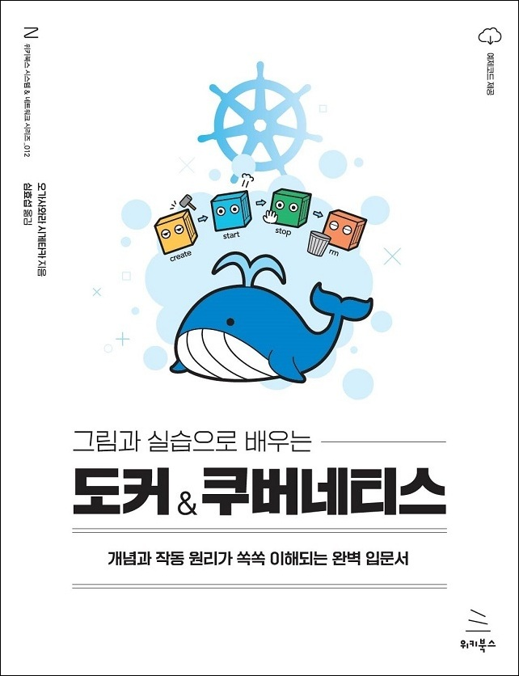

# 《그림과 실습으로 배우는 도커 & 쿠버네티스》

# 1장: 도커란 무엇인가
- [01 도커란 무엇인가?](https://velog.io/@gaengmin/Docker1-1-%EB%8F%84%EC%BB%A4%EB%9E%80-%EB%AC%B4%EC%97%87%EC%9D%B8%EA%B0%80)
- [02 서버와 도커](https://velog.io/@gaengmin/Docker1-2-%EC%84%9C%EB%B2%84%EC%99%80-%EB%8F%84%EC%BB%A4)

# 2장: 도커의 동작 원리
- [01 도커의 동작 원리](https://velog.io/@gaengmin/posts)
- [02 도커 허브와 이미지, 그리고 컨테이너](https://velog.io/@gaengmin/posts)
- [03 도커 컨테이너의 생애주기와 데이터 저장](https://velog.io/@gaengmin/posts)
- [04 도커의 장점과 단점](https://velog.io/@gaengmin/posts)

# 3장: 도커를 사용해보자
- [01 도커를 사용하려면](https://velog.io/@gaengmin/posts)
- [02 도커 설치](https://velog.io/@gaengmin/posts)
- [03 도커의 조작 방법과 명령 프롬프트 및 터미널 실행](https://velog.io/@gaengmin/posts)

# 4장: 컨테이너를 실행해 보자
- [01 도커 엔진 시작하기/종료하기](https://velog.io/@gaengmin/posts)
- [02 컨테이너의 기본적인 사용 방법](https://velog.io/@gaengmin/posts)
- [03 컨테이너의 생성과 삭제, 실행, 정지](https://velog.io/@gaengmin/posts)
- [04 컨테이너의 통신](https://velog.io/@gaengmin/posts)
- [05 컨테이너 생성에 익숙해지기](https://velog.io/@gaengmin/posts)
- [06 이미지 삭제](https://velog.io/@gaengmin/posts)

# 5장: 여러 개의 컨테이너를 연동해 실행해보자
- [01 워드프레스 구축](https://velog.io/@gaengmin/posts)
- [02 워드프레스 및 MySQL 컨테이너 생성과 연동](https://velog.io/@gaengmin/posts)
- [03 명령어를 직접 작성하자](https://velog.io/@gaengmin/posts)
- [04 레드마인 및 MariaDB 컨테이너를 대상으로 연습하자](https://velog.io/@gaengmin/posts)

# 6장: 실전에 활용 가능한 컨테이너 사용법을 익히자
- [01 내게 필요한 지식이 무엇인지 정리하기](https://velog.io/@gaengmin/posts)
- [02 컨테이너와 호스트 간에 파일 복사하기](https://velog.io/@gaengmin/posts)
- [03 볼륨 마운트](https://velog.io/@gaengmin/posts)
- [04 컨테이너로 이미지 만들기](https://velog.io/@gaengmin/posts)
- [05 컨테이너 개조](https://velog.io/@gaengmin/posts)
- [06 도커 허브 등록 및 로그인](https://velog.io/@gaengmin/posts)

# 7장: 도커 컴포즈를 익히자
- [01 도커 컴포즈란?](https://velog.io/@gaengmin/posts)
- [02 도커 컴포즈의 설치와 사용법](https://velog.io/@gaengmin/posts)
- [03 도커 컴포즈 파일을 작성하는 법](https://velog.io/@gaengmin/posts)
- [04 도커 컴포즈 실행](https://velog.io/@gaengmin/posts)

# 8장: 쿠버네티스를 익히자
- [01 쿠버네티스란?](https://velog.io/@gaengmin/posts)
- [02 마스터 노드와 워커 노드](https://velog.io/@gaengmin/posts)
- [03 쿠버네티스의 구성과 관련 용어](https://velog.io/@gaengmin/posts)
- [04 쿠버네티스 설치 및 사용법](https://velog.io/@gaengmin/posts)
- [05 매니페스트 파일(정의 파일) 작성](https://velog.io/@gaengmin/posts)
- [06 쿠버네티스 명령어](https://velog.io/@gaengmin/posts)
- [07 쿠버네티스를 연습하자](https://velog.io/@gaengmin/posts)

--- 
## 예제 파일

이 책의 예제 파일은 `sample_files` 폴더에 들어 있습니다.

## 참고 자료

#### 3장 2절 63쪽, 단계 4에서 리눅스 커널 업데이트에서 에러가 발생하는 경우

"wsl_update_x64.msi"를 관리자 권한으로 실행해 보세요.

#### 3장 2절 65쪽, Docker Desktop을 시작할 때 오류가 발생하는 경우

Docker Desktop을 관리자 권한으로 실행해 보세요.

#### 5장 4절에서 Redmine이 시작하지 않는 오류가 발생하는 경우

MySQL 컨테이너를 시작한 후 즉시 Redmine 컨테이너를 시작하면 MySQL 컨테이너가 아직 시작되지 않아 Redmine 컨테이너를 시작하지 못할 수 있습니다. 이는 Redmine 컨테이너가 시작될 때 MySQL에 연결할 수 없으면 종료되기 때문입니다. 해결책은 두 가지가 있습니다.

##### 해결 방법 1】 MySQL 컨테이너가 기동할 때까지 기다리고 나서 Redmine 컨테이너를 기동

MySQL 컨테이너를 기동한 뒤, docker ps 커맨드로 MySQL이 기동한 것을 확인한 후 Redmine 컨테이너를 시작합니다.

##### [해결 방법 2] Redmine 컨테이너 다시 시작

다음 명령을 입력해서 Redmine 컨테이너를 다시 시작합니다.

~~~
docker start redmine000ex14
~~~

또한 프로그램이 종료된 원인 등은 다음 커맨드를 통해 로그에서 확인할 수 있습니다.

~~~
docker logs redmine000ex14
~~~

#### 부록 03 342쪽, 도커 설치에 대해

최신 도커 설치 방법이 바뀌고 있습니다. 342쪽의 단계 1 또는 344쪽의 단계 6에 대해서는 다음 페이지를 참조합니다.

- https://docs.docker.com/engine/install/ubuntu/#install-using-the-repository

실행하는 범위는 "Install using the repository"에서 "Install Docker Engine"까지입니다.
