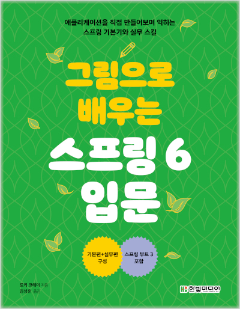

# 그림으로 배우는 스프링 6 입문 학습
> **11월 11일부터 다시 스프링 학습**

## [전체 정리 목차 링크](https://velog.io/@gaengmin/series/%EA%B7%B8%EB%A6%BC%EC%9C%BC%EB%A1%9C-%EB%B0%B0%EC%9A%B0%EB%8A%94-%EC%8A%A4%ED%94%84%EB%A7%81-6)

## 목차
### 1부. 기본편
1. [스프링 개요 - 241111](https://velog.io/@gaengmin/Spring그림으로-배우는-스프링-6-Chapter1장) 
2. [웹 애플리케이션 개요 - 241111](https://velog.io/@gaengmin/Spring그림으로-배우는-스프링-6-Chapter2장) 
3. [DI의 개념 - 241112](https://velog.io/@gaengmin/Spring%EA%B7%B8%EB%A6%BC%EC%9C%BC%EB%A1%9C-%EB%B0%B0%EC%9A%B0%EB%8A%94-%EC%8A%A4%ED%94%84%EB%A7%81-6-Chapter3-4%EC%9E%A5)
4. [DI 컨테이너 - 241112](https://velog.io/@gaengmin/Spring%EA%B7%B8%EB%A6%BC%EC%9C%BC%EB%A1%9C-%EB%B0%B0%EC%9A%B0%EB%8A%94-%EC%8A%A4%ED%94%84%EB%A7%81-6-Chapter3-4%EC%9E%A5)
5. [스테레오타입 애너테이션](https://velog.io/@gaengmin/Spring%EA%B7%B8%EB%A6%BC%EC%9C%BC%EB%A1%9C-%EB%B0%B0%EC%9A%B0%EB%8A%94-%EC%8A%A4%ED%94%84%EB%A7%81-6-Chapter5%EC%9E%A5)
6. [프로파일로 설정 전환하기](https://velog.io/@gaengmin/Spring%EA%B7%B8%EB%A6%BC%EC%9C%BC%EB%A1%9C-%EB%B0%B0%EC%9A%B0%EB%8A%94-%EC%8A%A4%ED%94%84%EB%A7%81-6-6%EC%9E%A5-%ED%94%84%EB%A1%9C%ED%8C%8C%EC%9D%BC%EB%A1%9C-%EC%84%A4%EC%A0%95-%EC%A0%84%ED%99%98)
7. [JavaConfig와 @Bean 메서드](https://velog.io/@gaengmin/Spring%EA%B7%B8%EB%A6%BC%EC%9C%BC%EB%A1%9C-%EB%B0%B0%EC%9A%B0%EB%8A%94-%EC%8A%A4%ED%94%84%EB%A7%81-6-7%EC%9E%A5-JavaConfig-Bean-%EB%A9%94%EC%86%8C%EB%93%9C)
8. [스프링 JDBC: 데이터베이스 접근 1](https://velog.io/@gaengmin/Spring%EA%B7%B8%EB%A6%BC%EC%9C%BC%EB%A1%9C-%EB%B0%B0%EC%9A%B0%EB%8A%94-%EC%8A%A4%ED%94%84%EB%A7%81-6-8%EC%9E%A5-%EC%8A%A4%ED%94%84%EB%A7%81-JDBC-%EB%8D%B0%EC%9D%B4%ED%84%B0%EB%B2%A0%EC%9D%B4%EC%8A%A4-%EC%A0%91%EA%B7%BC-1) | [스프링 JDBC: 데이터베이스 접근 2](https://velog.io/@gaengmin/Spring%EA%B7%B8%EB%A6%BC%EC%9C%BC%EB%A1%9C-%EB%B0%B0%EC%9A%B0%EB%8A%94-%EC%8A%A4%ED%94%84%EB%A7%81-6-8%EC%9E%A5-%EC%8A%A4%ED%94%84%EB%A7%81-JDBC-JdbcTemplate-%ED%81%B4%EB%9E%98%EC%8A%A4-2)
9. [선언적 트랜잭션](https://velog.io/@gaengmin/Spring%EA%B7%B8%EB%A6%BC%EC%9C%BC%EB%A1%9C-%EB%B0%B0%EC%9A%B0%EB%8A%94-%EC%8A%A4%ED%94%84%EB%A7%81-6-9)
10. [스프링 부트로 생산성 향상하기](https://velog.io/@gaengmin/Spring%EA%B7%B8%EB%A6%BC%EC%9C%BC%EB%A1%9C-%EB%B0%B0%EC%9A%B0%EB%8A%94-%EC%8A%A4%ED%94%84%EB%A7%81-6-10%EC%9E%A5-%EC%8A%A4%ED%94%84%EB%A7%81-%EB%B6%80%ED%8A%B8)
11. [스프링 MVC + Thymeleaf](https://velog.io/@gaengmin/Spring%EA%B7%B8%EB%A6%BC%EC%9C%BC%EB%A1%9C-%EB%B0%B0%EC%9A%B0%EB%8A%94-%EC%8A%A4%ED%94%84%EB%A7%81-6-11%EC%9E%A5-%EC%8A%A4%ED%94%84%EB%A7%81-MVC)
12. [RESTful 웹 서비스 만들기](https://velog.io/@gaengmin)
13. [갱신 계열 REST API 만들기](https://velog.io/@gaengmin)
14. [스프링 시큐리티](https://velog.io/@gaengmin)

### 2부. 실무편
15. [싱글톤과 스레드 세이프](https://velog.io/@gaengmin)
16. [스프링 JDBC: JOIN 결과 가져오기](https://velog.io/@gaengmin)
17. [데이터베이스 접근 시 예외 처리](https://velog.io/@gaengmin)
18. [트랜잭션 전파](https://velog.io/@gaengmin)
19. [세션 스코프](https://velog.io/@gaengmin)
20. [플래시 스코프](https://velog.io/@gaengmin)
21. [Security Context 활용](https://velog.io/@gaengmin)
22. [RESTful 웹 서비스 호출](https://velog.io/@gaengmin)
23. [프로퍼티 외부화](https://velog.io/@gaengmin)
24. [자동 테스트와 스프링의 테스트 지원](https://velog.io/@gaengmin)
25. [Repository 단위 테스트](https://velog.io/@gaengmin)
26. [Service 단위 테스트](https://velog.io/@gaengmin)
27. [Service · Repository 통합 테스트](https://velog.io/@gaengmin)
28. [Controller 단위 테스트](https://velog.io/@gaengmin)
29. [Controller·Service·Repository 통합 테스트](https://velog.io/@gaengmin)
30. [RESTful 웹 서비스 테스트](https://velog.io/@gaengmin)
31. [스프링 시큐리티의 테스트 지원](https://velog.io/@gaengmin)
32. [Selenide를 사용한 E2E 테스트](https://velog.io/@gaengmin)

### 3부. 부록
- [A.1 트랜잭션](https://velog.io/@gaengmin)
- [A.2 AP 서버](https://velog.io/@gaengmin)
- [A.3 인터페이스](https://velog.io/@gaengmin)
- [A.4 커맨드라인 인수](https://velog.io/@gaengmin)
- [A.5 애너테이션](https://velog.io/@gaengmin)
- [A.6 DataSource](https://velog.io/@gaengmin)
- [A.7 내장 DB](https://velog.io/@gaengmin)
- [A.8 검사 예외와 비검사 예외](https://velog.io/@gaengmin)
- [A.9 Map](https://velog.io/@gaengmin)
- [A.10 ThreadLocal](https://velog.io/@gaengmin)
- [A.11 로그 레벨과 로거](https://velog.io/@gaengmin)
- [A.12 Maven](https://velog.io/@gaengmin)
- [A.13 클래스 패스](https://velog.io/@gaengmin)
- [A.14 템플릿 파일과 템플릿 엔진](https://velog.io/@gaengmin)
- [A.15 HTTP 요청과 HTTP 응답의 데이터 구조](https://velog.io/@gaengmin)
- [A.16 요청 파라미터](https://velog.io/@gaengmin)
- [A.17 컨텍스트 패스](https://velog.io/@gaengmin)
- [A.18 YAML](https://velog.io/@gaengmin)
- [A.19 JSON](https://velog.io/@gaengmin)
- [A.20 서블릿과 서블릿 필터](https://velog.io/@gaengmin)
- [A.21 리다이렉트와 포워드](https://velog.io/@gaengmin)
- [A.22 Serializable](https://velog.io/@gaengmin)
- [A.23 JUnit](https://velog.io/@gaengmin)
- [A.24 JSONPath](https://velog.io/@gaengmin)
- [A.25 수강 신청 애플리케이션](https://velog.io/@gaengmin)
- [A.26 상품 주문 애플리케이션](https://velog.io/@gaengmin)
